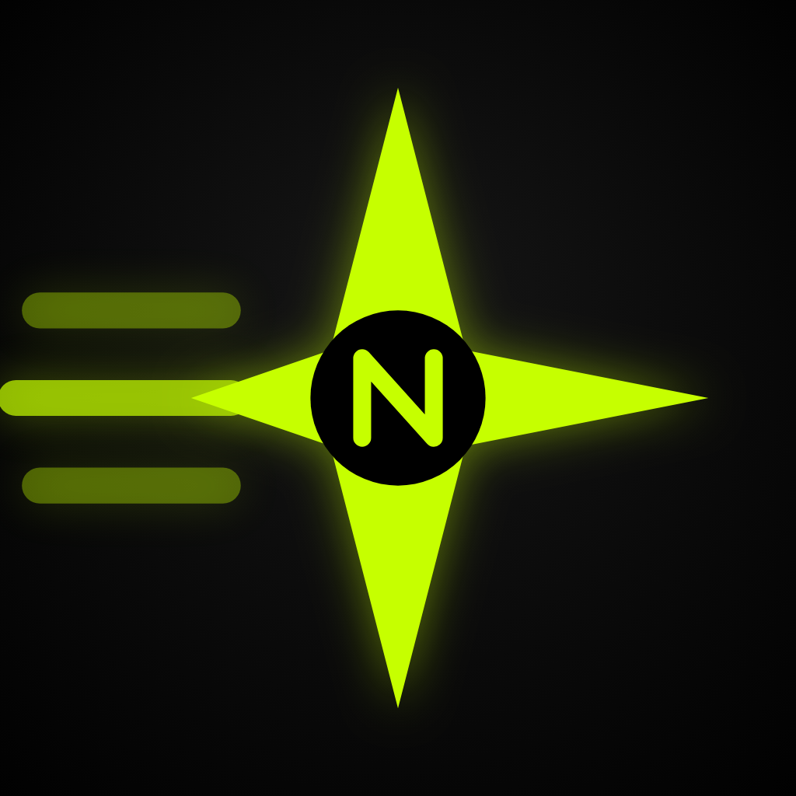
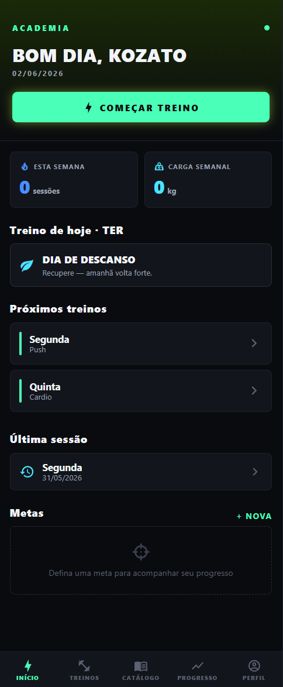
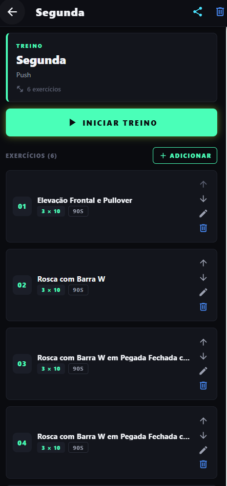
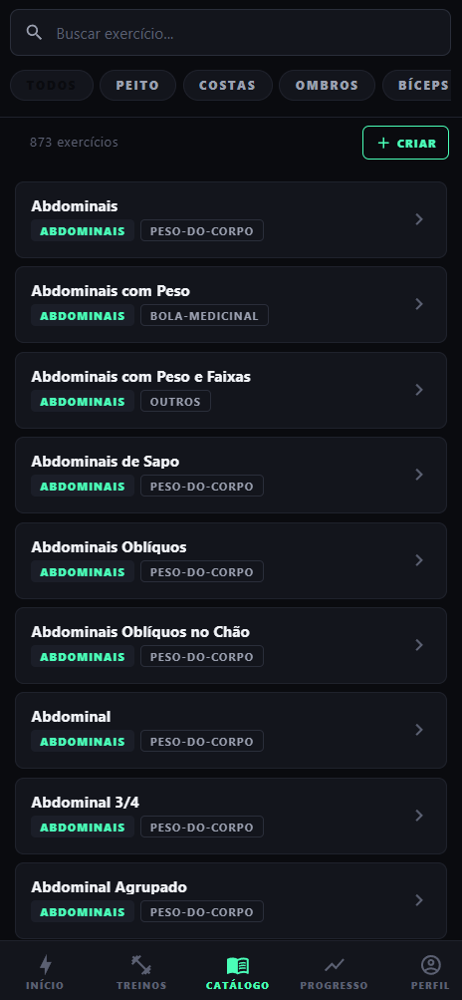

<div align="center">
  <br /><br />
  <h1>Treino-UP</h1>
  <p><strong>App mobile de registro e planejamento de treinos com integração de wearables</strong></p>

  
  
  
  
  
  
</div>

---

## 💡 Por que o Treino-UP existe?

A maioria dos apps de academia cobra assinatura, exibe anúncios ou exige que você crie conta antes de registrar um único treino. O **Treino-UP** existe pra ser diferente: **offline, gratuito e sem cadastro** — seus dados ficam no dispositivo e pronto.

A proposta é direta: chegar na academia, abrir o app, registrar o treino e ir embora. O wearable captura FC e calorias automaticamente pelo Health Connect, o histórico se constrói sozinho, e exportar tudo é só um toque em Ajustes.

Este é o meu **primeiro app mobile** — desenvolvido como projeto de estudo de **Ionic React + Capacitor**, explorando integração com APIs nativas do Android — Health Connect, botão físico de voltar, filesystem — sem depender de nenhum servidor.
> O app ainda não está na Google Play. A loja tem requisitos específicos para apps de saúde e permissões de wearable que estou estudando antes de submeter. Por enquanto, a instalação é feita via APK.

---

## 🛠️ Stack

| Camada | Tecnologia |
|---|---|
| UI |   |
| Roteamento |  |
| Estado |  |
| Gráficos |  |
| Build |  |
| App nativo |  |
| Wearable |  |
| Exercícios |  |

> Sem backend — todo o estado é persistido localmente via Zustand + `localStorage`.

---

## 🏠 Dashboard

<div align="center">
  
  <br/><sub>Tela inicial — treino do dia, metas e métricas de saúde</sub>
</div>

<br/>

**Sua academia na palma da mão.**

- 📅 Treino do dia em destaque com acesso direto
- 🎯 Metas ativas com barra de progresso
- 🕒 Histórico recente de sessões concluídas
- 📊 Volume semanal de um relance
- ❤️ Métricas de saúde do dia (passos, FC, calorias)

---

## 🏋️ Treinos & Sessão Ativa

<div align="center">
  
  <br/><sub>Sessão ativa — séries, pesos, RPE e timer de descanso</sub>
</div>

<br/>

**Planejamento e execução em um só lugar.**

- 📋 Treinos personalizados com catálogo de 870+ exercícios
- ✨ Gerador automático por grupo muscular e nível _(iniciante / intermediário / avançado)_
- ⏱️ Sessão ao vivo — séries, pesos e RPE em tempo real.
- 🔔 Timer de descanso automático entre séries.
- 🧠 Sugestão de peso automática — pré-preenche com o peso da última sessão; se todas as séries bateram o alvo, sugere +2.5kg.
- ❤️ FC média/máx e calorias capturadas do wearable ao finalizar.
- 📦 Rotinas semanais com planejamento dia a dia.

---

## 📚 Catálogo de Exercícios

<div align="center">
  
  <br/><sub>Catálogo — busca por nome, músculo ou equipamento</sub>
</div>

<br/>

**873 exercícios em PT-BR, sempre à mão.**

- 🔍 Busca por nome, grupo muscular ou equipamento
- 🖼️ Imagens, músculos envolvidos e instruções
- 🔄 Troca de exercício diretamente no gerador ou na sessão
- 🏷️ Categorias, equipamentos e mecânica de movimento

#### Busca inteligente com sinônimos

O motor de busca usa um índice pré-computado com expansão de sinônimos — digitar qualquer variação encontra o exercício certo:

| Você digita | Também encontra |
|---|---|
| `crucifixo` | fly, butterfly, pec deck |
| `supino` | bench press |
| `agachamento` | squat |
| `remada` | row, pulldown, puxada |
| `rosca` | curl |
| `peito` | chest, pec |
| `costas` | back, lat, dorsais |

Tokens são combinados em **AND** e normalizados sem acento — `Bíceps` e `biceps` são equivalentes.

---

## 🔄 Pipeline de Dados — Exercícios

Os 873 exercícios do catálogo vêm do **[Free Exercise DB](https://github.com/yuhonas/free-exercise-db)**, uma base pública com dados em inglês. Para uso no app, os dados passam por um ETL (`etl.py`) que transforma o JSON original em `exercises_pt.json`:

**1. Extração** — leitura do `exercises.json` original da Free Exercise DB

**2. Transformação**
- 🏷️ **Nomes híbridos** — termos clássicos substituídos por equivalentes PT-BR (`Bench Press → Supino`, `Squat → Agachamento`, `Row → Remada`); termos sem equivalente natural mantidos em inglês (`Deadlift`, `Snatch`, `Burpee`)
- 💪 **Músculos, equipamentos e níveis** — mapeados via dicionário técnico (`hamstrings → isquiotibiais`, `dumbbell → halteres`, `beginner → iniciante`)
- 📝 **Instruções** — traduzidas via Google Translate (`deep_translator`) com pós-processamento para padronizar linguagem (`"Expire ao fazer" → "Solte o ar durante"`)

**3. Carga** — resultado salvo em `src/data/exercises_pt.json` e bundled no app em build time

```bash
# Rodar o ETL (requer Python + deep_translator)
pip install deep-translator
python etl.py
```

> O app nunca faz chamadas de rede para buscar exercícios — o JSON completo é embutido no bundle.

---

## 📊 Acompanhamento, Saúde & Compartilhamento

### 📈 Progresso & Metas

| | |
|---|---|
| 📈 **Progresso** | Gráficos de volume semanal, peso corporal e frequência de treinos |
| 🎯 **Metas** | Defina metas de carga, frequência ou volume e acompanhe a evolução |
| 🏆 **Conquistas** | Badges desbloqueáveis com base no progresso real |
| 💾 **Backup** | Exportar e importar dados em JSON; compartilhar treinos individuais |
| 🍽️ **Dieta** | Plano alimentar com refeições, horários e itens; adicione e remova refeições livremente |

### ❤️ Saúde & Wearable

O app lê dados do **Android Health Connect** — o agregador oficial do Google, compatível com qualquer app que escreva nele.

> O app **não** pareia com o relógio diretamente. Isso é feito pelo app do fabricante via Bluetooth.

**Fontes compatíveis:**
Samsung Health · Google Fit · Mi Fit / Zepp · Garmin Connect · Fitbit · Polar Flow · Strava · Huawei Health · Withings · Oura

| Métrica | Detalhe |
|---|---|
| 👣 Passos | Diário e histórico de 7 / 30 dias |
| ❤️ Frequência cardíaca | Média e máxima durante a sessão |
| 💤 FC de repouso | Histórico de 7 dias |
| 🔥 Calorias ativas | Por sessão e histórico diário |
| ⚖️ Peso & gordura corporal | Sincronizado do app de saúde |

> **Requisitos:** Android 8.0+ · Health Connect instalado (nativo no Android 14+) · pelo menos um app de saúde autorizado

### 📤 Compartilhamento & Importação

Treinos e rotinas são compartilhados como JSON via qualquer app (WhatsApp, e-mail, Drive, etc.) pelo `@capacitor/share`.

| Formato | Conteúdo |
|---|---|
| `workout-share` | Treino único + seus exercícios |
| `workout-pack-share` | Rotina completa + treinos dos dias + exercícios |

O app detecta automaticamente o tipo pelo campo `type` do JSON. Treinos importados aparecem na aba **Importados**, separados dos criados pelo usuário.

> Para backup completo de todos os dados, use **Exportar tudo** em Ajustes.

---

## 📁 Estrutura do Projeto

```
src/
├── pages/
│   ├── tabs/               # Barra de navegação inferior
│   │   ├── HomePage        → Dashboard: treino do dia, metas, histórico
│   │   ├── TreinosPage     → Hub: rotinas / treinos livres / importados
│   │   ├── ExerciciosPage  → Catálogo com busca por nome e músculo
│   │   ├── ProgressoPage   → Gráficos: volume, peso, frequência
│   │   └── AjustesPage     → Perfil, backup e configurações
│   ├── workouts/           # Treinos & rotinas
│   ├── sessions/           # Sessões ativas e concluídas
│   ├── health/             → Saúde & Wearable (Health Connect)
│   ├── goals/              → Criar e acompanhar metas
│   └── info/               → Conquistas e sobre o app
├── stores/                 # Estado global (Zustand)
│   ├── data.ts             → Treinos, sessões, metas, métricas
│   ├── session.ts          → Sessão ativa em andamento
│   └── settings.ts         → Perfil e preferências
├── data/                   # Dados e lógica de domínio
│   ├── exercises_pt.json   → 873 exercícios em PT-BR
│   ├── exercises.ts        → Busca com sinônimos e ranking
│   └── workoutGenerator.ts → Gerador automático de treinos
└── services/
    └── healthConnect.ts    → Integração com Health Connect
```

---

## 🚀 Getting Started

### Pré-requisitos

- [Node.js](https://nodejs.org/) 18+
- [Android Studio](https://developer.android.com/studio) com Android SDK instalado
- JDK 17+ (o Android Studio instala automaticamente)

### Rodar no navegador (web)

```bash
git clone https://github.com/Kozato01/academia.git
cd academia
npm install
npm run dev       # abre em http://localhost:5173
```

### Rodar no Android

```bash
npm install
npm run build           # gera dist/
npx cap sync android    # copia bundle + instala plugins nativos
npx cap open android    # abre o Android Studio
```

No Android Studio: selecione o dispositivo/emulador e clique em **Run ▶**.

> **Nota:** `android/local.properties` (caminho do SDK) é gerado automaticamente pelo Android Studio na primeira abertura — não precisa criar manualmente.

---

## ⚙️ Outros comandos úteis

```bash
npm run typecheck     # verificar tipos sem emitir
npm run preview       # preview do build de produção local
npx cap copy android  # apenas copia o bundle (sem reinstalar plugins — mais rápido)
```

---

## 🗺️ Roadmap

Funcionalidades planejadas ou em pausa:

- [ ] **Aquecimento & Cardio** — feature já implementada no código (`AquecimentoCardioPage` + `SessaoAtivaTimedPage`), desativada enquanto o escopo é decidido
- [ ] **Empty states com CTAs** — telas de Home e Progresso sem dados ainda não têm ilustrações ou chamadas para ação
- [ ] **Conquistas revisadas** — validar se os critérios de desbloqueio cobrem os casos reais de uso
- [ ] **Mais métricas wearable** — SpO₂ e dados de sono já têm campo reservado em `DailyMetrics` mas ainda não são lidos
- [ ] **Versão iOS** — Capacitor suporta, mas Health Connect é Android-only; precisaria de integração com HealthKit

---

## 📲 Download

**[⬇️ Baixar APK — ver Releases](../../releases/latest)**

> Para instalar, habilite **"Instalar apps desconhecidos"** nas configurações do Android.

---

## 📄 Licença

Distribuído sob a **[Polyform Noncommercial License 1.0](LICENSE)** — livre para usar, copiar, modificar e distribuir. Uso comercial e venda são proibidos.

---

<div align="center">
  Feito com dedicação por <strong><a href="https://github.com/Kozato01">Kozato01</a></strong><br /><br />
  <sub>Treino-UP · v1.0.0 MVP · Android</sub>
</div>
